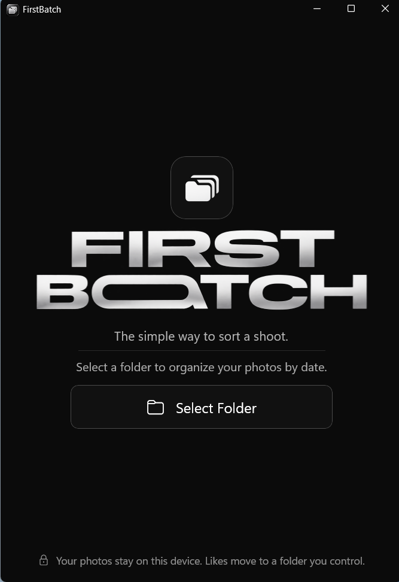
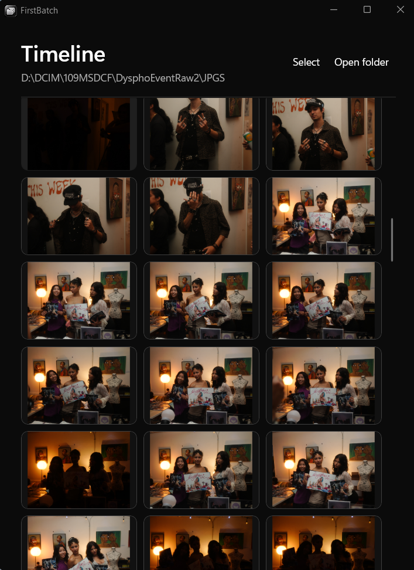
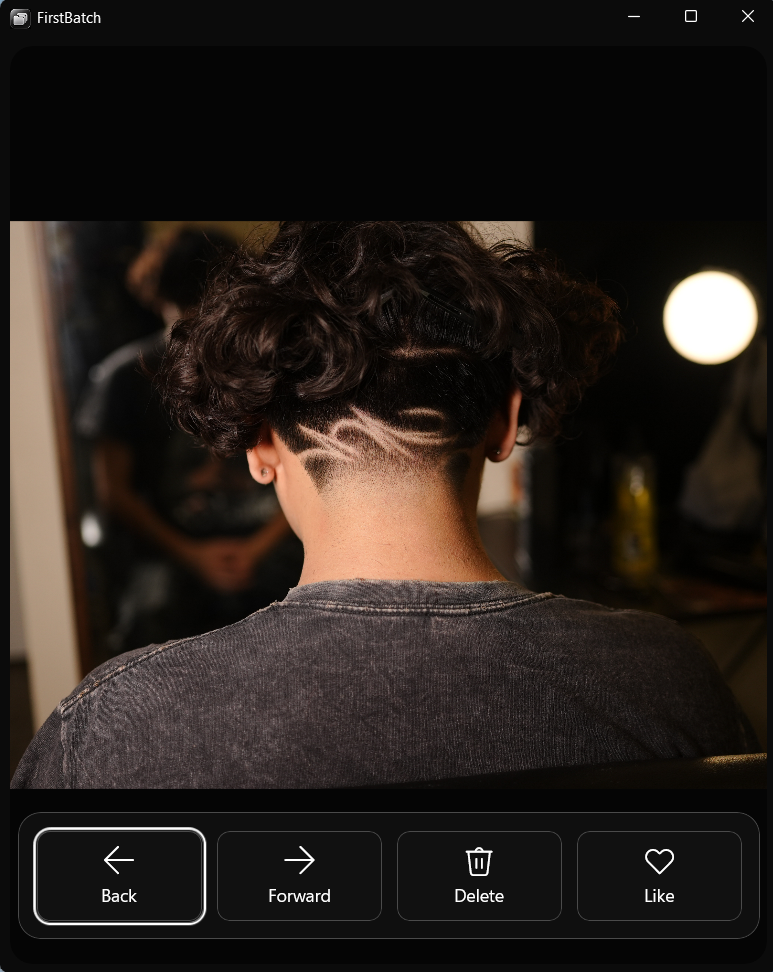

# FirstBatch

> **The simple way to sort a shoot.**

FirstBatch is a minimal Windows app for choosing the winners from a large photo shootquickly, locally, and without breaking creative flow.

Get it for the Microsoft Store here: https://apps.microsoft.com/detail/9PL9MVN51JQS?hl=en-us&gl=US&ocid=pdpshare

Check out FirstBatch Creative Concept Page: https://firstbatch-rho.vercel.app/

I am a software engineer and part-time photographer. I built FirstBatch after repeatedly running into the same problem: most photo-culling tools either lock useful workflow features behind a paywall or surround a simple task with cluttered screens, menus, and interruptions. Neither fit the way I wanted to work after a shoot.

FirstBatch turns the review process into a focused sequence: open a folder, start at a date, decide whether each image stays or goes, and keep moving. It is a tool I use regularly, and I continue to improve it through real-world use.

## Product walkthrough

### 1. Start with the shoot

The welcome screen keeps the entry point simple: choose a folder and begin. No account, import workflow, or unnecessary setup.



### 2. Review the timeline

Photos are shown together in a date-based timeline so a full shoot can be reviewed in context. Users can filter by file type or select a group when they need a batch action.



### 3. Make fast decisions

The viewer gives the image almost the entire window. Back, forward, delete, and like are always simple to reach, while keyboard controls keep the culling process moving.



## The problem I set out to solve

After a shoot, a photographer may need to review hundreds or thousands of near-duplicate frames. The usual Windows workflow means clicking individual files, opening menus, manually moving favourites, and worrying that a mistaken delete is permanent. Each small interruption makes the process slower and less enjoyable.

FirstBatch was designed around the opposite principle: the interface should get out of the way. The app uses a black-and-white visual system, a simple date timeline, and keyboard-first decisions so the attention stays on the photograph.

## What FirstBatch does

- Presents a complete photo timeline grouped by capture date, so a shoot can be reviewed in context.
- Opens each image in a large, distraction-free viewer.
- Lets the user move forward, move back, like, or delete using the keyboard.
- Moves liked photos into a local `Liked` folder and deleted photos into a recoverable local `Deleted` folder.
- Supports undo, so a rushed or accidental decision is easy to reverse.
- Supports multi-select, range selection, and creating named folders for a batch of images.
- Filters the timeline by file type, including JPEG, PNG, HEIC, TIFF, WebP, and common camera RAW formats.
- Reads embedded RAW previews so photographers can cull camera files quickly without needing a full editing workflow.

## Product and design decisions

### Minimal by intention

The interface has three clear stages: choose a folder, review the timeline, and cull in the photo viewer. There are no expandable panels, bright accent colours, account prompts, or analytics-driven distractions. Controls remain available, but the viewer chrome hides until the pointer reaches an edge so the photo stays central.

### Designed for momentum

The core actions sit under the left hand: `S` keeps a photograph, `D` sends it to the recoverable Deleted folder, arrow keys navigate, and `Ctrl+Z` reverses a choice. The goal is to let a photographer complete a full culling pass without leaving the keyboard.

### Safe, local file management

FirstBatch works only with folders the user selects. It does not upload, collect, share, sell, or track photos. A delete is implemented as a local move rather than a destructive operation, because a culling tool should make decisions faster without making mistakes more expensive.

## Engineering approach

This project is built around the Windows platform because its native file system, image infrastructure, and packaging model fit a local-first photography workflow.

| Technology | How I use it in FirstBatch |
| --- | --- |
| **C# and .NET** | Used for the application logic: scanning folders, managing sorting actions and undo history, keeping the viewer responsive, and structuring the code into focused services and models. |
| **WinUI 3** | Used to create a native Windows interface with a precise, minimal layout and responsive interaction states for the timeline, photo viewer, selection workflow, and keyboard controls. |
| **Windows App SDK** | Used to integrate native Windows capabilities such as the folder picker and modern desktop application behavior, so the app feels at home on Windows rather than like a browser wrapped as an app. |
| **MSIX and Microsoft Store** | Used to package, distribute, and update FirstBatch through a familiar, trusted Windows installation path. This supports ongoing releases without asking users to manage installers manually. |
| **EXIF and embedded RAW previews** | Used to organize images by capture date, display portrait images correctly, and make common RAW camera files practical to browse quickly. Preview extraction is a deliberate choice: it serves the culling task without the overhead of building a full RAW editor. |

The architecture separates image discovery, metadata extraction, RAW preview handling, image loading, file movement, and UI interaction. That keeps the parts that deal with files and camera formats isolated from the user interface, making the app easier to maintain as new workflows are added.

## Try it

### Microsoft Store

FirstBatch is published for Windows through the Microsoft Store. Search for **FirstBatch** in the Store to install the current release.

### Run from this repository

For developers or reviewers who want to inspect the project locally:

1. Install the **.NET 10 SDK** on Windows 10 version 1809 or later (Windows 11 recommended).
2. Clone this repository and open the `FirstBatch` folder.
3. Run:

   ```powershell
   dotnet build
   dotnet run
   ```

4. Choose a folder containing photos, then select a date in the timeline to begin reviewing.

To produce a self-contained Windows build:

```powershell
dotnet publish -c Release -r win-x64 --self-contained true -p:WindowsPackageType=None
```

## Keyboard workflow

| Shortcut | Action |
| --- | --- |
| `S` | Like the current photo |
| `D` | Move the current photo or selection to `Deleted` |
| `Left` / `Right` | Previous / next photo |
| `Ctrl+Z` | Undo the most recent sort action |
| `Ctrl+A` | Select all timeline photos |
| `Ctrl+O` | Choose another folder |
| `Escape` | Return to the timeline or clear a selection |

## Ongoing development

FirstBatch is a daily-use project, not a one-time demo. I use it while sorting my own shoots and release improvements as real workflows reveal opportunities to make the process faster, clearer, and safer.

## Privacy

Photos remain on the user's device. FirstBatch does not require an account and does not upload, sell, share, collect, or track user photos or personal data.

## License

Copyright © Bryan Castle. All rights reserved.
